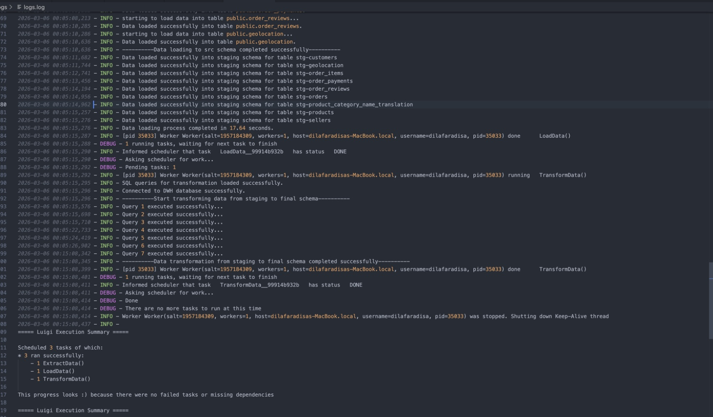
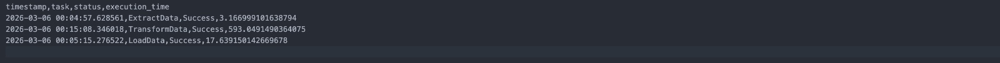

# ELT Pipeline Orhcestration

This project was created as part of the assignment from Pacmann.ai. In this project, I act as a data engineer and responsible for building an ELT pipeline for a Brazilian e-commerce business, Olist. In this scenario, Olist wants to build a Data Warehouse to support its growing business and more complex data. For the full story, you can visit my article on Medium. In this repository, I will focus on developing the ELT pipeline.

## 1. Requirements
- OS :
    - Linux
    - WSL (Windows Subsystem For Linux)
- Tools :
    - Dbeaver
    - Docker
    - Cron
- Programming Language :
    - Python
    - SQL
- Python Libray :
    - Luigi
    - Pandas
    - Sentry-SDK
- Platforms :
    - Sentry
 
## 2. Preparations
- **Clone repo** :
  ```
  # LFS Clone
  git lfs clone https://github.com/rahilaode/pacflight_data-pipeline-orchestration.git
  ```

- **Create Sentry Project** :
  - Open : https://www.sentry.io
  - Signup with email to get notifications abot the error
  - Create Project :
    - Select Platform : Python
    - Set Alert frequency : `On every new issue`
    - Create project name.
  - After create the project, **store SENTRY DSN of the project into .env file**.

- In thats project directory, **create and use virtual environment**.
  
- In the virtual environment, **install requirements** :
  ```
  pip install -r requirements.txt
  ```

- **Create env file** in project root directory :

  here is the example
  ```
  # Source
  SRC_POSTGRES_DB=...
  SRC_POSTGRES_HOST=...
  SRC_POSTGRES_USER=...
  SRC_POSTGRES_PASSWORD=...
  SRC_POSTGRES_PORT=...

  # DWH
  DWH_POSTGRES_DB=...
  DWH_POSTGRES_HOST=...
  DWH_POSTGRES_USER=...
  DWH_POSTGRES_PASSWORD=...
  DWH_POSTGRES_PORT=...

  # SENTRY DSN
  SENTRY_DSN=... # Fill with Sentry DSN Project 

  # DIRECTORY
  DIR_ROOT_PROJECT=...     # <project_dir>
  DIR_TEMP_LOG=...         # <project_dir>/pipeline/temp/log
  DIR_TEMP_DATA=...        # <project_dir>/pipeline/temp/data
  DIR_EXTRACT_QUERY=...    # <project_dir>/pipeline/src_query/extract
  DIR_LOAD_QUERY=...       # <project_dir>/pipeline/src_query/load
  DIR_TRANSFORM_QUERY=...  # <project_dir>/pipeline/src_query/transform
  DIR_LOG=...              # <project_dir>/logs/
    ```

- **Configure Database** :

  - create a docker compose to set up the source database and data warehouse database
  - then store the credentials into .env file
  - run the docker compose with this command in terminal
  ```
  docker compose up -d
  ```

## 3. Building the pipeline

- **create schema for the database**

  next is setting up schemas, tables, and attributes according to the previously designed data model.
  - [source database](helper/source_init/init.sql)
  - target database:
      - [source schema (src)](helper/dwh_init/dwh-src-schema.sql)
      - [staging schema (stg)](helper/dwh_init/dwh-stg-schema.sql)
      - [final schema (final)](helper/dwh_init/dwh-final-schema.sql)

- **create utility functions**

  next i created several functions that will support the orchestration process
  - [database connector](pipeline/utils/db_connect.py) : Function to create a database connection.
  - [SQL file reader](pipeline/utils/read_sql.py) : function to read SQL query files and returns as strings.
  - [copy log function](pipeline/utils/copy_log.py) : function to copy temporary log file into main log file.
  - [delete temporary data](pipeline/utils/delete_temp_data/py) : function to clean temporary pipeline data

- **create ELT task with Luigi**

  After finishing the configuration, i developed several task
  - [ExtractData](pipeline/extract.py)
    
    The ExtractData task is used to extract data from the source database and save it temporarily. The outputs of this task are CSV files for each table, a task summary such as        the task status and execution time, and a log file.
  - [LoadData](pipeline/load.py)
 
    This LoadData task is used to load the CSV files extracted from the previous task into the target database in the source schema (src). Then, the data is loaded from the            src schema into the staging schema. The outputs of this task are a task summary and a log file.

  - [TransformData](pipeline/transform.py)

    Finally, there is the TransformData, in this task, data is pulled from staging schema and transformed according to the design that was defined erlier, then loaded into the         final schema. The outputs of this task are a task summary and a log file
    
- **compile task**

  - next is compiling all the task that created before into a single main script, for example [elt_main.py](elt_main.py)
  - then run the main script to review the entire pipeline
  - evaluate the outputs, logs, and summaries

    here are few example of the log file and the task summary
    - logs
      

    - task summary
      
    
  
